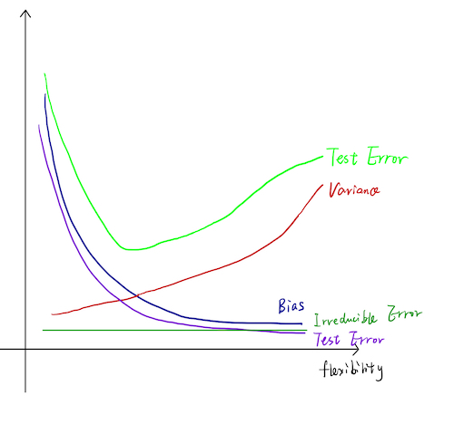

---
output:
  html_document: default
  word_document: default
  pdf_document: default
---
# Homework 1

Wentao Zhu

## 1

P52, 2.4.2

### a
Regression. Inference. n = 500 (firms), p = 3 (profit, number of employees, industry).

### b
Classification. Prediction. n = 20 (similar products previously launched). p = 13 (price charged, marketing budget, competition price, ten other variables).

### c
Regression. Prediction. n = 52 (weekely change of dollar in 2012). p = 3(% change in US/German/British market).

## 2

P52, 2.4.3

### a

 
 
### b
- **Bias**: decreases as the method’s flexibility increases because of it has less constraints.
- **Variance**: increases as the method’s flexibility increases because the model relies on the input data more.
- **Training Error**: decreases as the method’s flexibility increases because the more flexible model makes the model fit the training data better.
- **Test Error**: decreases first, and then increases. Increases in flexibility
generates a closer fit before overfitting.
- **Irreducible Error**: is the same regardless of the model. It depends on the distribution of $\epsilon$

## 3

P53, 2.3.7

### a

```{r}
Obs = matrix(data=c(0,2,0,0,-1,1,3,0,1,1,0,1,0,0,3,2,1,1), nrow=6, ncol=3)
Pred <- c(0,0,0)
for (i in 1:6) {
   print(sqrt(sum((Obs[i,]-Pred)^2)))
}

```

### b

Green. The nearest neighbor is `Obs[5]`, which is green.

### c

Red. The 3-nearest neighbors are `Obs[5]`, `Obs[6]`, `Obs[2]`, which are green, red, red.

### d

Small. A small K would be able to capture more local non-linear decision information.

## 4

P413, 10.7.1

### a

$$
\begin{eqnarray}
\frac{1}{|C_k|} \sum\limits_{i,i^{\prime} \in C_k} \sum\limits_{j=1}^p (x_{ij} - x_{i^\prime j})^2 &=& 
\frac{1}{|C_k|} \sum\limits_{i,i^{\prime} \in C_k} \sum\limits_{j=1}^p ((x_{ij} - \bar{x}_{kj}) - (x_{i^\prime j} - \bar{x}_{kj}))^2
\\
&=& \frac{1}{|C_k|} \sum\limits_{i,i^{\prime} \in C_k} \sum\limits_{j=1}^p ((x_{ij} - \bar{x}_{kj})^2 - 2 (x_{ij} - \bar{x}_{kj})(x_{i^\prime j} - \bar{x}_{kj}) + (x_{i^\prime j} - \bar{x}_{kj})^2)
\\
&=&  \sum\limits_{i \in C_k} \sum\limits_{j=1}^p (x_{ij} - \bar{x}_{kj})^2 +
   \sum\limits_{i^{\prime} \in C_k} \sum\limits_{j=1}^p (x_{i^\prime j} - \bar{x}_{kj})^2 -
  \frac{2}{|C_k|} \sum\limits_{i,i^{\prime} \in C_k} \sum\limits_{j=1}^p (x_{ij} - \bar{x}_{kj})(x_{i^\prime j} - \bar{x}_{kj})
\\
&=& 2 \sum\limits_{i \in C_k} \sum\limits_{j=1}^p (x_{ij} - \bar{x}_{kj})^2
\end{eqnarray}
$$

### b

From (a), we have:

$$
\frac{1}{|C_k|} \sum\limits_{i,i^{\prime} \in C_k} \sum\limits_{j=1}^p (x_{ij} - x_{i^\prime j})^2 = 2 \sum\limits_{i \in C_k} \sum\limits_{j=1}^p (x_{ij} - \bar{x}_{kj})^2
$$

To minimize $\frac{1}{|C_k|} \sum\limits_{i,i^{\prime} \in C_k} \sum\limits_{j=1}^p (x_{ij} - x_{i^\prime j})^2$, we only need to minimize $\sum\limits_{i \in C_k} \sum\limits_{j=1}^p (x_{ij} - \bar{x}_{kj})^2$. 

In every round of iteration, $\sum\limits_{i \in C_k} \sum\limits_{j=1}^p (x_{ij} - \bar{x}_{kj})^2$ is minimized by definition (assigning every point to the closest cluster centroid).

## 5

P413, 10.7.2

### a

```{r}
G = as.dist(matrix(c(0, 0.3, 0.4, 0.7, 
                     0.3, 0, 0.5, 0.8,
                     0.4, 0.5, 0.0, 0.45,
                     0.7, 0.8, 0.45, 0.0), nrow=4, ncol=4))
plot(hclust(G, method="complete"))
```

### b

```{r}
plot(hclust(G, method="single"))
```

### c
- 1,2
- 3,4

### d
- 1,2,3
- 4

### e
```{r}
plot(hclust(G, method="complete"), labels=c(4,3,2,1))
```

## 6

P414, 10.7.4

### a

Not enough information to tell. It depends on the exact average distance and minimum distance of two clusters. If the two distances are equal, they would fuse at the same height. Else the single linkage dendogram would fuse at a lower height.

### b

Same. Height of fusions of leaf nodes are not influenced by the linkage method.


## 7

P416, 10.7.9

### a

```{r}
library(ISLR)
original = hclust(dist(USArrests), method="complete")
plot(original)
```

### b
```{r}
original_result = cutree(original, 3)
original_result
```

### c

```{r}
std = scale(USArrests)
scaled = hclust(dist(std), method="complete")
plot(scaled)
```

### d

```{r}
scaled_result = cutree(scaled, 3)
scaled_result
```
```{r}
table(original_result, scaled_result)
```

Though the dendogram seems alike for two methods, the clustering results are quite different. I think the dataset should be scaled before performing clustering because the metrics are easily influenced by the units adopted. In this dataset particularly, *UrbanPop* is different from other 3 coloumn from the perspective of unit.
```{r}
head(USArrests)
```

## 8

P120 3.7.4

### a

We could expect the cubic regression to have a lower training RSS
than the linear regression for it has more flexibility and produces a tighter fit (though maybe meaningless).

### b

The test RSS of cubic regression fit could be higher than the linear one for excessive predictors lead to overfitting.

### c

We could always expect the cubic regression to have a lower training RSS
than the linear regression for it has more flexibility and produces a tighter fit (regardless of what  the true relationship is).

### d

There is not enough information to tell. The result generally depends on whether the underlying relationship is more close to linear or cubic. 

## 9

P122 3.7.9

### a

```{r}
library(ISLR)
data(Auto)
pairs(Auto)
```

### b

```{r}
cor(subset(Auto, select=-name))
```

### c

```{r}
lmans = lm(mpg~.-name, data=Auto)
summary(lmans)
```

1. Yes. The F-statistic suggests that the null hypothesis is wrong.
2. A low $p$-valueindicates that the predictor is important. Important variables: displacement, weight, year, origin. 
3. The estimated coefficient suggests `year` has a relatively strong postive effect on `mpg`.

### d

```{r}
par(mfrow=c(2,2))
plot(lmans)
```

The linear regression result is not good enough because the residual plots are distributed on a curve rather than randomly. 

Observation 14 has an unsually high leverage.

### e

Here are two examples of statistically significant interaction exxfects:

```{r}
try1 = lm(mpg~displacement+weight+year*origin, data=Auto)
summary(try1)
```
```{r}
try2 = lm(mpg~displacement*weight+year+origin, data=Auto)
summary(try2)
```

### f

```{r}
try3 = lm(mpg~I(displacement^2)+I(log(weight))+sqrt(year)+origin, data=Auto)
summary(try3)
par(mfrow=c(2,2))
plot(try3)
```
```{r}
try3 = lm(mpg~displacement+I(sqrt(weight))+year+sqrt(origin), data=Auto)
summary(try3)
par(mfrow=c(2,2))
plot(try3)
```

By incresing the flexibility of the models properly, the performance generally improves.

## 10

P125 3.7.14


### a

```{r}
set.seed(1)
x1 = runif(100)
x2 = 0.5*x1+rnorm(100)/10
y = 2 + 2*x1 + 0.3*x2 + rnorm(100)
```
$y = \beta_{0} + \beta_{1} x_1 + \beta_{2} x_2 + \epsilon$

$\beta_{0}=2$, $\beta_{1}=2$, $\beta_{2}=0.3$

### b

```{r}
cor(x1,x2)
```
```{r}
plot(x1,x2)
```

### c

```{r}
fity <- lm(y~x1+x2)
summary(fity)
```
Estimated beta coefficients: $\hat{\beta_{0}}=2.13$, $\hat{\beta_{1}}=1.44$, $\hat{\beta_{2}}=1.01$. 

$\hat{\beta_{0}}$ is close to the true $\beta_0$, while $\hat{\beta_{1}}$, and $\hat{\beta_{2}}$ have high error.

Reject $H_0 : \beta_1=0$; Cannot reject $H_0 : \beta_2=0$.

### d

```{r}
fity1 <- lm(y~x1)
summary(fity1)
```
The null hypothesis can be rejected because the $p$-value for its t-statistic is small enough.

### e

```{r}
fity2 <- lm(y~x2)
summary(fity2)
```
The null hypothesis can be rejected because the $p$-value for its t-statistic is small enough.

### f

No.
The two input variables, $x_1$ and $x_2$ are related to one another, making it difficult to separate out the individual effects of two variables. This is called Collinearity.

### g

```{r}
x1 = c(x1, 0.1)
x2 = c(x2, 0.8)
y = c(y,6)
fity <- lm(y~x1+x2)
summary(fity)
fity1 <- lm(y~x1)
summary(fity1)
fity2 <- lm(y~x2)
summary(fity2)
```

```{r}
par(mfrow=c(2,2))
plot(fity)
```

```{r}
par(mfrow=c(2,2))
plot(fity1)
```
```{r}
par(mfrow=c(2,2))
plot(fity2)
```

- In the first model, x1 turns statistically insignificance and x2 turns statistiscal significance.
- The new observation has more effects in the first model.
- The new observation is an outlier in the first and the third model.
- The new observation is a high-leverage in the first and the third model.


